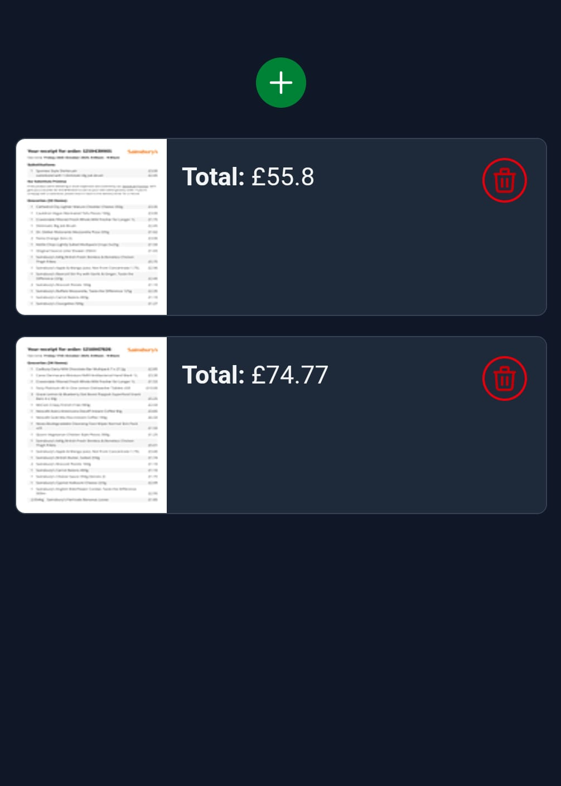
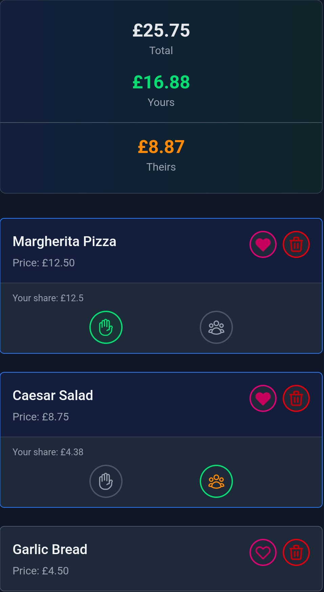
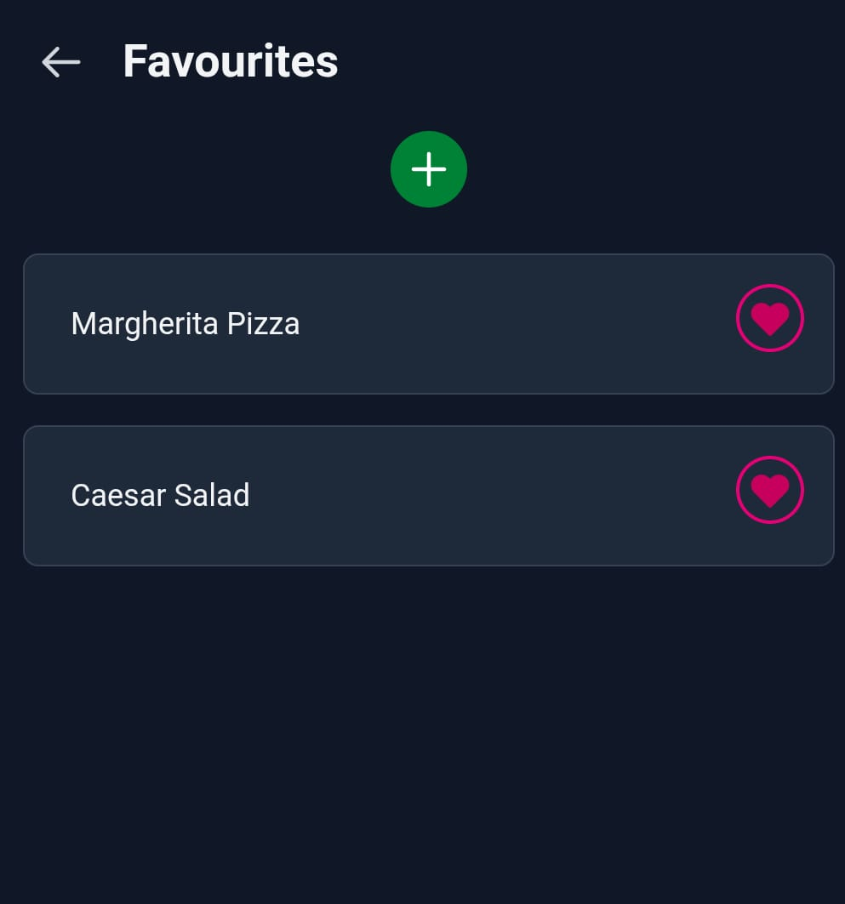

# [Split Me](https://split-me.app) 🔗

## How it works

### 1. Create a split
Upload a picture or PDF of your receipt to create a new Split. We'll automatically process it and extract all the items.

  

### 2. Select your items
Go through the list and select the items you ordered. You can mark them as yours or shared. We'll calculate your share and theirs automatically.

  

### 3. Remember your favourites
Have things you order frequently? Mark them as favourite (little heart icon) and they'll be automatically selected the next time they're spotted on a receipt!

  

